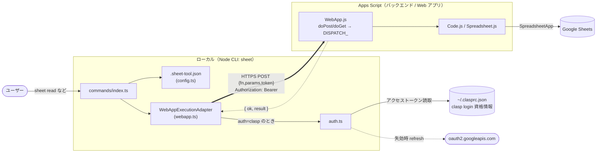
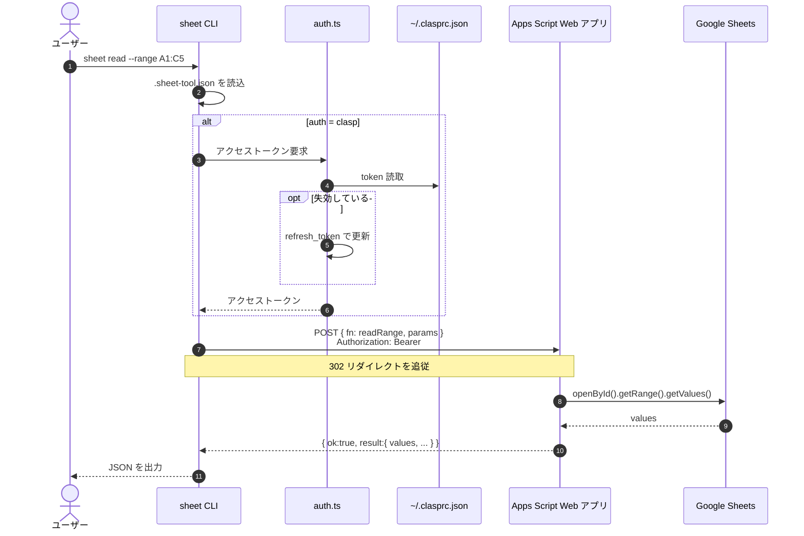
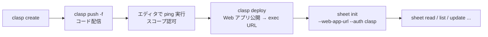

# clasp-sheet-cli

Google Apps Script の **Web アプリ(HTTP)** 経由で、ローカルから Google Sheets を操作する CLI です。

Local CLI for manipulating Google Sheets through a Google Apps Script **Web App** over HTTP.

実行コマンド名は `sheet` です。

## Overview / 概要

- Spreadsheet の業務ロジックは **Apps Script（バックエンド）** に集約し、CLI は入出力・設定・HTTP 実行・整形だけを担う薄いフロント
- 実行は Apps Script **Web アプリ(`doPost`/`doGet`)への HTTP 呼び出し**。Google Sheets REST API も `clasp run` / `scripts.run` も使わない
- **GCP レス**: 専用 GCP プロジェクト・OAuth クライアント JSON・サービスアカウント・API キーのいずれも不要

CLI と Apps Script は次の RPC 契約でやり取りします。

```text
request  : { "fn": "<関数名>", "params": [ ... ], "token": "<共有シークレット・任意>" }
response : { "ok": true, "result": <値> } | { "ok": false, "error": "<メッセージ>" }
```

> **用語の区別**: request の `token` は**共有シークレット**（後述の `SHEET_TOOL_TOKEN`）。認証に使う **OAuth アクセストークン**（`Authorization: Bearer`、`clasp` 由来）とは別物です。本 README では前者を「共有シークレット」、後者を「アクセストークン」と呼び分けます。

### なぜ Web アプリ方式か（GCP レスの理由）

`clasp run`（`scripts.run` API）は「呼び出し側 OAuth クライアントと対象スクリプトが**同一の標準 GCP プロジェクト**に属すること」を要求し、実質 GCP プロジェクトの作成・紐付け＋`clasp login --creds` が必須になります。実行を **Web アプリ + HTTP** に置き換えることでこれを回避し、GCP レスを実現しています。

> ただし `clasp`（`create` / `push` / `deploy`）でコードを配信するために、アカウント単位の **Apps Script API 有効化**（<https://script.google.com/home/usersettings>）は必要です。これは *コード管理* のためで、*実行* 用の GCP プロジェクトとは別物です。

## Access model / アクセスと認証（重要）

Web アプリのアクセス範囲は `apps-script/appsscript.json` の `webapp` 設定で決まり、組織（Google Workspace）のポリシーで選べる範囲が変わります。

| access | 誰が呼べるか | CLI 側の認証 | 備考 |
|---|---|---|---|
| `ANYONE_ANONYMOUS` | URL を知る全員（匿名） | 不要（`auth: none`） | 手軽。ただし**管理者が禁止していることが多い** |
| `DOMAIN` | デプロイ者と同じ組織ドメインのユーザー | **必要**（`auth: clasp`） | 匿名が禁止の組織向け。本 README の既定 |
| `MYSELF` | デプロイ者本人のみ | **必要**（`auth: clasp`） | 最も限定的 |

`DOMAIN` / `MYSELF` では呼び出しに `Authorization: Bearer <アクセストークン>` が必要です。`--auth clasp` を指定すると、**既存の `clasp login` の資格情報（`~/.clasprc.json`）からアクセストークンを取得**し、失効時は refresh_token で自動更新します（追加の GCP/OAuth 設定は不要）。

> ⚠️ **アカウント整合**: `DOMAIN` の判定基準は「スクリプトをデプロイした＝`clasp` がログインしているアカウントのドメイン」です。複数アカウント（例: グループ会社を跨いで保有）がある場合、**`clasp` のログイン先**と**対象シートにアクセスできるアカウント**を一致させてください。ズレると `401`（ドメイン不一致）になります。

## Architecture / 構成

```text
.
├── apps-script/            # バックエンド (Apps Script)
│   ├── Code.js             #   公開関数 (ping / readRange / appendRows ...)
│   ├── Spreadsheet.js      #   Spreadsheet 操作の実体
│   ├── Utils.js            #   バリデーション等
│   ├── WebApp.js           #   HTTP エントリポイント (doPost/doGet → RPC ディスパッチ)
│   └── appsscript.json     #   scopes + webapp デプロイ設定
├── src/                    # フロント (CLI)
│   ├── cli.ts
│   ├── config.ts           #   .sheet-tool.json の読み書き
│   ├── webapp.ts           #   Web アプリ実行アダプタ (HTTP)
│   ├── auth.ts             #   clasp 資格情報からアクセストークン取得/自動更新
│   ├── commands/index.ts
│   └── types.ts
├── package.json
└── tsconfig.json
```

コマンドは抽象実行インターフェース `ExecutionAdapter` に依存し、実行は **HTTP 実行 (`WebAppExecutionAdapter`)** に一本化されています（将来 MCP や別方式へ差し替えられる構造は維持）。

### コンポーネントと実行時データフロー



### `sheet read` のシーケンス



### セットアップ / デプロイの流れ

`clasp` はこの流れ（**デプロイ時**）で使い、実行時（`sheet read` 等）には使いません。



## Prerequisites / 前提

- Node.js 20+ / npm
- clasp（`npm install -g @google/clasp`）
- Google アカウント（複数ある場合は対象シートにアクセスできるものを `clasp login` に使う）
- **Apps Script API 有効化**（アカウント単位）: <https://script.google.com/home/usersettings>

## Quickstart

`DOMAIN` アクセス + `--auth clasp` を前提とした最短手順です（各ステップの位置づけは上の「セットアップ / デプロイの流れ」図を参照）。

```bash
# 0) clone
git clone https://github.com/shase/clasp-sheet-cli.git
cd clasp-sheet-cli

# 1) clasp を用意してログイン（対象シートにアクセスできるアカウントで）
npm install -g @google/clasp
clasp login

# 2) CLI をビルドしてリンク
npm install
npm run build
npm link

# 3) バックエンドの Apps Script を作成して push
cd apps-script
clasp create --type standalone --title "clasp-sheet-cli-backend"
clasp push -f

# 4) スコープを認可（初回のみ）: エディタで関数「ping」を1回実行し OAuth 同意を承認
clasp open

# 5) Web アプリとしてデプロイし、exec URL を取得
clasp deploy --description "web app"
#   出力の Deployment ID (AKfyc...) から URL を組み立てる:
#     https://script.google.com/macros/s/<DEPLOYMENT_ID>/exec

# 6) 設定を初期化
cd ..
sheet init \
  --clasp-project ./apps-script \
  --script-id <SCRIPT_ID> \
  --spreadsheet-id <SPREADSHEET_ID> \
  --default-sheet <SHEET_NAME> \
  --web-app-url "https://script.google.com/macros/s/<DEPLOYMENT_ID>/exec" \
  --auth clasp

# 7) 診断 → 読み取り
sheet doctor
sheet read --range A1:C5
```

> - `<SCRIPT_ID>` は `apps-script/.clasp.json` の `scriptId`。
> - `<SHEET_NAME>` はタブ名。日本語 UI の新規シートは `Sheet1` ではなく `シート1` のことがあるので `sheet list` で確認。
> - 以降コードを変更したときの反映（再デプロイ）は [Updating / 更新（再デプロイ）](#updating--更新再デプロイ) を参照。

## Configuration / 設定ファイル

`sheet init` はプロジェクトルートに `.sheet-tool.json` を生成します（実 URL・ID を含むため `.gitignore` 済み。詳細は [Security](#security--セキュリティ)）。

```json
{
  "claspProjectPath": "apps-script",
  "scriptId": "<SCRIPT_ID>",
  "spreadsheetId": "<SPREADSHEET_ID>",
  "defaultSheet": "シート1",
  "webAppUrl": "https://script.google.com/macros/s/<DEPLOYMENT_ID>/exec",
  "auth": "clasp"
}
```

| フィールド | 必須 | 説明 |
|---|---|---|
| `webAppUrl` | ✔ | 呼び出す Web アプリの `/exec` URL |
| `spreadsheetId` | ✔ | 操作対象のスプレッドシート ID |
| `auth` |  | `clasp`（アクセストークンを clasp 資格情報から付与）/ `none`（既定・ヘッダなし） |
| `defaultSheet` |  | `--sheet` 省略時に使うシート名 |
| `token` |  | 各呼び出しに付与する**共有シークレット**（`SHEET_TOOL_TOKEN` と照合） |
| `scriptId`, `claspProjectPath` | ✔ | `clasp push` / `deploy` の対象を指すメタ情報。**実行時には参照されません**（実行に使うのは `webAppUrl` / `auth`） |

## Usage / 使い方

```bash
sheet list

sheet read --sheet Sales --range A1:C20
sheet read --range A1:C20                 # --sheet 省略時は defaultSheet

sheet append --sheet Sales --json rows.json
cat rows.json | sheet append --sheet Sales
sheet append --sheet Sales --inline '[["2026-01-01",1200,"ok"]]'

sheet update --sheet Sales --range B2:D10 --json values.json
sheet clear  --sheet Sales --range A2:Z100

sheet create Inventory
sheet delete OldSheet

sheet status      # 設定とバックエンド疎通を表示
sheet doctor      # 環境診断
```

JSON 入力（`append` / `update`）は `--json <path>` / stdin / `--inline <json>` の 3 方式に対応。

## Updating / 更新（再デプロイ）

コードを変更したら、変更箇所に応じて反映します。

- **Apps Script を変更した場合**（`apps-script/` 配下: `Code.js` / `Spreadsheet.js` / `WebApp.js` / `appsscript.json`）
  ```bash
  cd apps-script
  clasp push -f                       # 変更をアップロード
  clasp deployments                   # 既存のデプロイ ID を確認
  clasp deploy -i <DEPLOYMENT_ID>     # 同じ exec URL を維持したまま再デプロイ
  ```
  `-i <DEPLOYMENT_ID>` を**省くと新しい URL の別デプロイ**になり、`.sheet-tool.json` の `webAppUrl` 差し替えが必要になります。公開関数を追加したときは `WebApp.js` の `DISPATCH_` への登録も忘れずに。

- **CLI (`src/`) を変更した場合**
  ```bash
  npm run build                       # npm link 済みなら sheet コマンドに即反映
  ```

> `push` は「コードのアップロード」、`deploy` は「その時点のコードを Web アプリとして公開」する別操作です。**`push` だけでは公開中の Web アプリは更新されません** — 反映には `deploy`（既存 URL 維持なら `-i`）が必要です。

## Security / セキュリティ

- **機微ファイルはコミットしない**（すべて `.gitignore` 済み）: `.sheet-tool.json`（exec URL・ID）、`apps-script/.clasp.json`（scriptId・ローカルパス）、`~/.clasprc.json`（資格情報・そもそもリポジトリ外）。
- `--auth clasp` は実行時に `~/.clasprc.json` からアクセストークンを読むだけで、**設定ファイルには保存しません**。
- **アクセスは `DOMAIN` / `MYSELF` を推奨**（`ANYONE_ANONYMOUS` は避ける）。URL が漏れても組織外/他人からは呼べません。
- さらに保護したい場合は**共有シークレット**を併用: スクリプトの Script Property に `SHEET_TOOL_TOKEN=<値>`（エディタ → プロジェクトの設定 → スクリプト プロパティ）を設定し、`sheet init --token <同じ値>` を付ける。不一致の呼び出しは `unauthorized` で拒否されます。
- 使い終わったデプロイは削除: `clasp undeploy <DEPLOYMENT_ID>`

## Corporate proxy / TLS 傍受環境（任意）

社内ネットワークが TLS を傍受して独自 CA を挿入している場合（Cloudflare WARP / Zscaler 等）、Node の HTTP や `clasp` が `self-signed certificate in certificate chain` で失敗することがあります。その場合のみ CA バンドルを Node に渡します（該当しなければ不要）。

```bash
# macOS: キーチェーンの全ルート CA を書き出して Node に渡す
mkdir -p ~/.certs
security find-certificate -a -p /Library/Keychains/System.keychain > ~/.certs/macos-ca.pem
security find-certificate -a -p /System/Library/Keychains/SystemRootCertificates.keychain >> ~/.certs/macos-ca.pem
export NODE_EXTRA_CA_CERTS="$HOME/.certs/macos-ca.pem"   # 恒久化するなら ~/.zshrc へ
```

## Troubleshooting / トラブルシュート

| 症状 | 対処 |
|---|---|
| `webapp-ping` が fail / `HTTP 401` | **ドメイン不一致が最有力**。`clasp` のログインアカウントと対象シートのアカウントを一致させる（→ [Access model](#access-model--アクセスと認証重要)） |
| レスポンスが JSON でない / HTML が返る | 認可未完了、またはアクセス設定が想定と違う。Quickstart 手順4の認可とデプロイの access 設定を確認 |
| `ANYONE access has been disabled by your domain administrator` | 匿名公開が組織で禁止。`appsscript.json` を `"access": "DOMAIN"` にして再デプロイし `--auth clasp` を使う |
| `unauthorized` | `SHEET_TOOL_TOKEN` と config の `token` を一致させる |
| `Sheet not found` | タブ名違い。`sheet list` で実名を確認（例: `シート1`） |
| `Unable to open spreadsheet` | `spreadsheetId` と、デプロイユーザーの共有権限を確認 |
| range エラー | A1 記法を確認（例 `A1:C20`） |
| `self-signed certificate in certificate chain` | [Corporate proxy](#corporate-proxy--tls-傍受環境任意) の `NODE_EXTRA_CA_CERTS` を設定 |
| clasp が見つからない / 未ログイン | `npm install -g @google/clasp` / `clasp login` |

## Development / 開発

```bash
npm run build       # tsc でビルド
npm run typecheck
npm run dev -- --help
```

機能追加の手順:

1. `apps-script/Code.js` に公開関数を追加（実体は `Spreadsheet.js`）
2. `apps-script/WebApp.js` の `DISPATCH_` に関数を登録
3. `src/commands/index.ts` に CLI サブコマンドを追加
4. 反映（再デプロイ・再ビルド）は [Updating / 更新（再デプロイ）](#updating--更新再デプロイ) の手順で
5. **Node 側に業務ロジックを持たせない**（入出力と実行制御のみ）

## Design notes / 設計メモ

「Google Sheets を操作したいだけなのに、GCP プロジェクトや独自 OAuth まで抱えたくない」という一点が設計の起点です。

- **GCP レスを制約として最優先**にした（理由は [なぜ Web アプリ方式か](#なぜ-web-アプリ方式かgcp-レスの理由)）。コスト削減ではなく設計の前提。
- **境界を固定**: 業務ロジックは Apps Script、CLI は薄く保つ。
- **認証は自前で持たず `clasp` を土台に間借り**する。`clasp` は「デプロイ時のツール」かつ「実行時の認証基盤」の二役で、実行時に clasp バイナリは起動しないが、その資格情報（`~/.clasprc.json`）には依存する。
- **実行方式は交換可能**（`ExecutionAdapter`）。現在は HTTP 一本で、GCP 依存を復活させる `scripts.run` へは戻さない。
- **Trade-off**: GCP レスは無償ではなく、(a) Web アプリのデプロイ運用 (b) clasp 資格情報への実行時依存、を対価として受け入れている。純粋な「デプロイ専用の clasp 利用」にするには実行時トークンを別に用意する必要があり、それは GCP を呼び戻すため GCP レスと両立しない。
